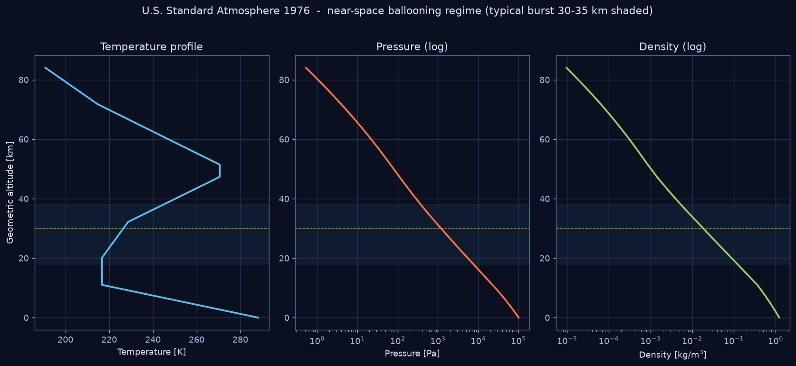

# 01 — The U.S. Standard Atmosphere 1976

`nearspace.atmosphere` implements the **U.S. Standard Atmosphere 1976**
(NOAA-S/T 76-1562), the reference model every aerospace flight tool — NPSS,
SPENVIS, the CUSF predictor, and T-MATS' own ambient block — assumes.



## Model structure

The 1976 model defines the atmosphere from the surface to 86 km geometric
altitude as **seven layers**, each with a constant *molecular-scale temperature
gradient* (lapse rate) `Lₘ`:

| Layer | Base geopotential h (km) | Lapse rate Lₘ (K/km) | Region |
|---|---|---|---|
| 0 | 0 | −6.5 | Troposphere |
| 1 | 11 | 0.0 | Tropopause (isothermal) |
| 2 | 20 | +1.0 | Stratosphere |
| 3 | 32 | +2.8 | Stratosphere |
| 4 | 47 | 0.0 | Stratopause (isothermal) |
| 5 | 51 | −2.8 | Mesosphere |
| 6 | 71 | −2.0 | Mesosphere |
| top | 84.852 | — | ~86 km geometric |

## Governing equations

**Geometric ↔ geopotential altitude.** Gravity weakens with height; the model
absorbs this into a geopotential height `h`, so that a constant `g₀` can be
used:

```
h = r₀·z / (r₀ + z)        with r₀ = 6 356 766 m   (USSA-1976)
```

**Temperature** within a layer is linear:

```
T(h) = Tᵦ + Lₘ·(h − hᵦ)
```

**Pressure** comes from hydrostatic balance + ideal gas. For a gradient layer
(`Lₘ ≠ 0`):

```
P(h) = Pᵦ · [ Tᵦ / (Tᵦ + Lₘ(h − hᵦ)) ] ^ ( g₀·M₀ / (R*·Lₘ) )
```

and for an isothermal layer (`Lₘ = 0`):

```
P(h) = Pᵦ · exp[ −g₀·M₀·(h − hᵦ) / (R*·Tᵦ) ]
```

**Density** and **speed of sound** follow from the perfect-gas relations:

```
ρ = P / (R·T)              R = R*/M₀ ≈ 287.053 J·kg⁻¹·K⁻¹
a = √(γ·R·T)               γ = 1.4
```

**Dynamic viscosity** uses the 1976 Sutherland law (Eq. 51):

```
μ = β·T^1.5 / (T + S)      β = 1.458×10⁻⁶,  S = 110.4 K
```

## Frozen 1976 constants

To reproduce the *published tables exactly*, the model uses the constants the
1976 document froze (which differ slightly from modern CODATA):

| Symbol | Value | Meaning |
|---|---|---|
| R\* | 8.31432 J·mol⁻¹·K⁻¹ | gas constant (1976) |
| M₀ | 0.0289644 kg·mol⁻¹ | sea-level mean molar mass of air |
| g₀ | 9.80665 m·s⁻² | standard gravity |
| r₀ | 6 356 766 m | effective Earth radius for geopotential |
| T₀ | 288.15 K | sea-level temperature |
| P₀ | 101 325 Pa | sea-level pressure |

## Validation

`tests/test_validation.py` checks the model at every layer boundary against the
official table. Result:

```
 h_km   T_model    T_ref     P_model       P_ref   P_err%
    0   288.150  288.150 101325.0000 101325.0000   0.0000
   11   216.650  216.650  22632.0640  22632.0600   0.0000
   20   216.650  216.650   5474.8887   5474.8890  -0.0000
   32   228.650  228.650    868.0187    868.0187  -0.0000
   47   270.650  270.650    110.9063    110.9063   0.0000
   51   270.650  270.650     66.9389     66.9389   0.0000
   71   214.650  214.650      3.9564      3.9564   0.0000
```

Pressure matches the published USSA-1976 values to **better than 0.001 %** —
the model is correct, not merely plausible.

## Why it matters for ballooning

- **Density** drives both buoyant lift (it *falls* with altitude, so a balloon
  expands and eventually bursts) and descent rate (it makes the parachute nearly
  useless at altitude — see [03](03_DESCENT_RECOVERY.md)).
- **Pressure** sets the ideal-gas volume of the lift gas at every altitude
  ([02](02_BALLOON_ASCENT.md)).
- **Temperature** is the cold-soak environment the payload thermal design must
  survive ([04](04_THERMAL.md)); the coldest point near 17–20 km (≈ −56 °C) is
  often the thermal sizing case.

## Usage

```python
from nearspace.atmosphere import atmosphere
s = atmosphere(30_000)          # geometric altitude in metres
print(s.temperature_C, s.pressure_hPa, s.density_kgm3)
```

A pre-computed table (0–86 km, 1 km steps) is at
[`../data/us_standard_atmosphere_1976.csv`](../data/us_standard_atmosphere_1976.csv);
regenerate it with `data/generate_atmosphere_table.py`.
