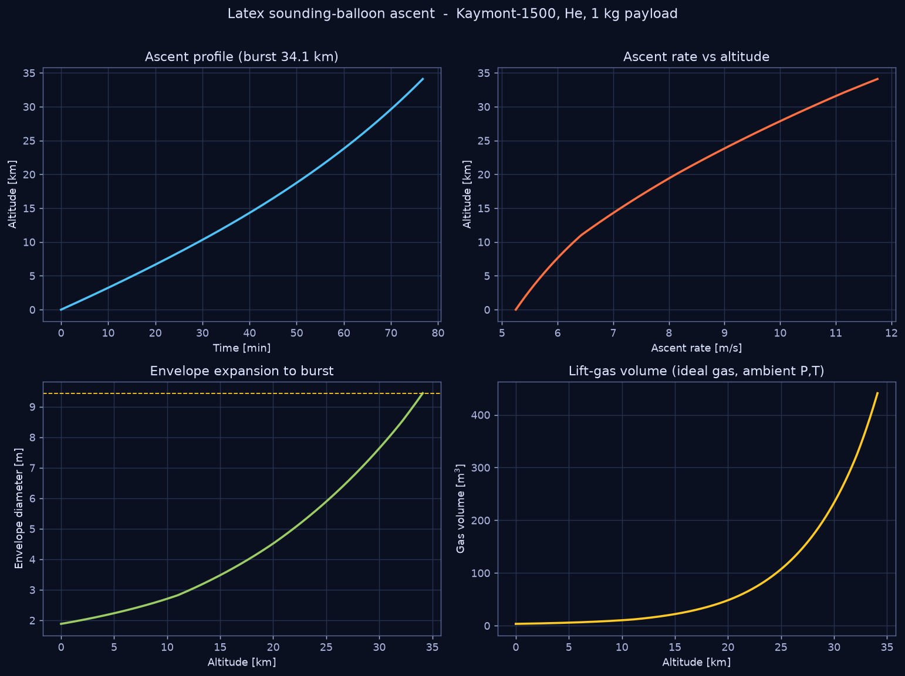
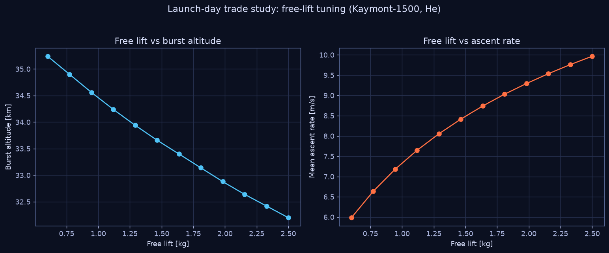

# 02 — Balloon Buoyancy, Ascent & Burst

`nearspace.lift_gas` + `nearspace.balloon` model the lighter-than-air physics
of a free latex sounding balloon from fill to burst.



## Buoyancy (Archimedes)

A volume `V` of lift gas immersed in ambient air generates a buoyant force equal
to the weight of displaced air. The **gross lift**, expressed as a force, is:

```
F_gross = (ρ_air − ρ_gas)·V·g
```

Both densities come from the ideal-gas law at the **ambient** pressure and
temperature, because a free latex balloon is *unpressurized* — the envelope is
slack and the internal pressure tracks ambient until just before burst:

```
ρ = P·M / (R*·T)
```

with molar masses `M_He = 4.0026`, `M_H₂ = 2.0159`, `M_air = 28.9644` g·mol⁻¹
(NIST). Hydrogen lifts ~8 % more than helium per unit volume and is far cheaper,
but is flammable — most NASA-ASCEND/ANSR student flights use helium.

The quantities a launch crew actually controls:

| Term | Definition |
|---|---|
| **Gross lift** | total buoyant force = (ρ_air − ρ_gas)·V·g |
| **Free lift** | gross lift − (payload + balloon + gas) weight |
| **Neck/nozzle lift** | force measured at the fill nozzle = free lift + payload |

`lift_gas.moles_for_free_lift()` inverts these relations to compute the moles of
gas (hence the fill volume) needed to hit a target free lift at launch.

## Ascent rate (drag balance)

At quasi-steady ascent the free-lift force is balanced by aerodynamic drag on
the roughly spherical envelope:

```
F_free = ½·ρ_air·C_d·A·w²      ⇒      w = √( 2·F_free / (ρ_air·C_d·A) )
```

where `A = (π/4)·D²` is the frontal area and `C_d ≈ 0.25` for a buoyant sphere
in the relevant Reynolds range (Gallice et al. 2011). Ascent rate is the key
operational parameter: too slow and the flight drifts too far / the balloon may
float; too fast and the balloon under-expands and bursts low. The NWS radiosonde
nominal is ~5 m/s.

## Envelope expansion & burst

As the balloon rises, ambient pressure falls and the (unpressurized) envelope
expands per the ideal-gas law:

```
V(z) = n·R*·T(z) / P(z)        D(z) = (6V/π)^{1/3}
```

Because `P` falls ~100× from surface to 30 km, the volume grows ~100× and the
diameter ~4.6×. **Burst occurs when `D(z)` reaches the manufacturer's published
burst diameter** (`data/balloons_burst_diameter.csv`). For a Kaymont-1500 the
burst diameter is 9.44 m → burst near 34–35 km in the model, matching the
datasheet.

## Integration scheme

`balloon.simulate_ascent()`:

1. Solve for the gas moles giving the requested free lift at launch.
2. March upward in altitude steps `Δz` (default 20 m). At each step pull
   `P, T, ρ` from the USSA-1976 model, recompute `V`, `D`, and the instantaneous
   drag-balance ascent rate `w`, and advance time by `Δt = Δz/w`.
3. Stop at burst (D ≥ D_burst) or float (w → 0).

## Worked result (defaults)

```
Balloon: Kaymont-1500  gas: helium  payload: 1.0 kg  free lift: 1.2 kg
  burst altitude   : 34.10 km
  burst diameter   : 9.44 m
  time to burst    : 76.8 min
  mean ascent rate : 7.85 m/s
  gas at fill      : 148.2 mol   (≈ 3.6 m³ at sea level)
```

## Launch-day trade study



Free lift is the single knob the crew tunes at the nozzle. More free lift →
faster ascent but **lower** burst altitude (the balloon hits burst diameter
sooner because it was filled to a larger initial volume). `examples/02` sweeps
this trade so a team can pick the free lift that meets *both* an altitude target
and an ascent-rate / drift constraint.

## Usage

```python
from nearspace.balloon import simulate_ascent
res = simulate_ascent("helium", payload_mass_kg=1.0,
                      balloon_model="Kaymont-1500", free_lift_kg=1.2)
print(res.burst_altitude_m, res.mean_ascent_rate_mps)
```
