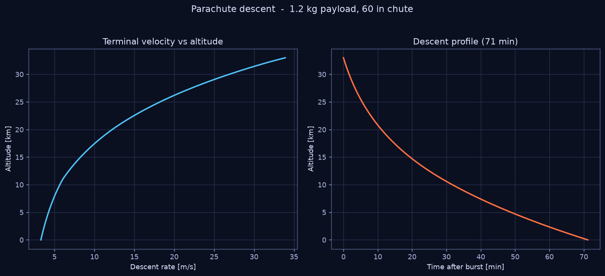
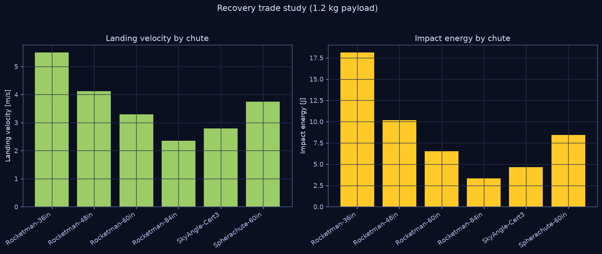

# 03 — Parachute Descent & Recovery

`nearspace.descent` models the post-burst fall under parachute and the
recovery-safety quantities bounded by 14 CFR Part 101.



## Terminal velocity

After burst, the payload train falls under its parachute. Within seconds it
reaches terminal velocity, where weight balances drag:

```
m·g = ½·ρ_air(z)·C_d·S·v²      ⇒      v(z) = √( 2·m·g / (ρ_air(z)·C_d·S) )
```

with `S = (π/4)·D²` the canopy area and `C_d` the canopy drag coefficient
(`data/parachutes.csv`; round/dome ≈ 0.75–1.0, cruciform hi-drag ≈ 1.4, per
Knacke NWC TP 6575).

## The altitude trap

The crucial, often-missed fact: **a parachute barely works at altitude.** Air
density at 30 km is ~1.5 % of sea level, so terminal velocity scales as
`v ∝ 1/√ρ` — about **8× faster** just after burst than at landing:

```
descent rate at 30 km = 26.7 m/s     (per validation suite)
descent rate at ground =  3.3 m/s
```

This is why the descent must be integrated with altitude-dependent density
(the toolkit does), not with a single constant terminal velocity. The fast
upper descent is also why most of the descent *time* is spent in the lower
atmosphere.

## Recovery safety — impact energy

The number that matters for safety (and for 14 CFR Part 101, see
[FAA](FAA_PART101.md)) is the **landing kinetic energy**:

```
E_impact = ½·m·v_land²
```

For a 1.2 kg payload under a 60-inch chute:

```
landing velocity : 3.30 m/s
impact energy    : 6.5 J
```

6.5 J is roughly the energy of a 0.7 kg book dropped from 1 m — gentle enough
to satisfy Part 101 and to protect both the payload and people/property on the
ground.

## Recovery trade study



`examples/03` compares the catalog parachutes for landing velocity and impact
energy at fixed payload mass, so a team can pick the smallest chute that still
lands safely (a smaller chute → less drift on descent → easier recovery, but
higher impact energy: a direct trade).

## Sizing rule of thumb

To hit a target landing velocity `v*` at the ground (ρ₀ = 1.225 kg/m³):

```
S = 2·m·g / (ρ₀·C_d·v*²)      D = √(4S/π)
```

The model then refines this with the real density profile.

## Usage

```python
from nearspace.descent import simulate_descent, terminal_velocity
res = simulate_descent(1.2, burst_altitude_m=33_000, parachute="Rocketman-60in")
print(res.landing_velocity_mps, res.impact_energy_J, res.descent_time_s)
```
