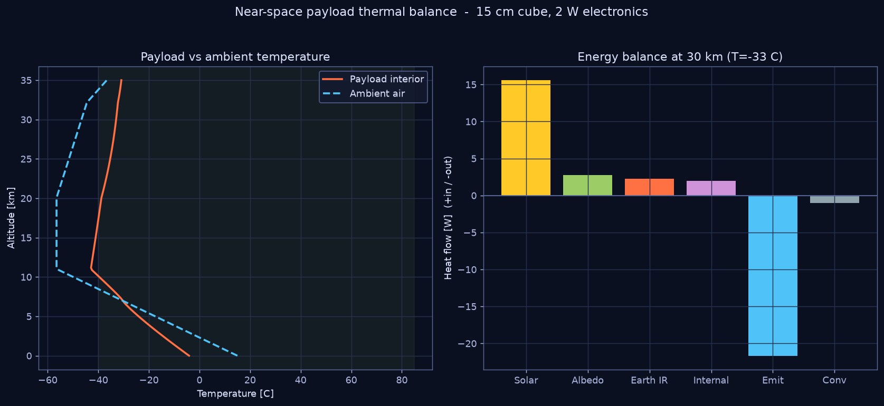

# 04 — Payload Thermal Balance

`nearspace.thermal` solves the steady-state energy balance of a near-space
payload. This is the balloon-payload analogue of the NASA T-MATS **HeatSoak**
and **1-D conduction** blocks — see [07_TMATS_BRIDGE](07_TMATS_BRIDGE.md).



## The near-space thermal environment

At 30 km the payload is in a near-vacuum (P ≈ 1 kPa, ρ ≈ 1.5 % of sea level),
so **convection nearly vanishes and radiation dominates** — much like a
spacecraft. The fluxes acting on the box are:

| Flux | Source | Sign |
|---|---|---|
| Direct solar | unattenuated sunlight, 1361 W·m⁻² | in |
| Albedo | sunlight reflected off Earth (a ≈ 0.30) | in |
| Earth IR | planetary longwave (~240 W·m⁻²) | in |
| Internal | electronics dissipation | in |
| Emission | gray-body radiation to cold sky | out |
| Convection | residual free convection (→0 aloft) | out |

## Governing balance

At steady state, in = out:

```
Q_solar + Q_albedo + Q_earthIR + Q_internal = Q_emit + Q_conv
```

with

```
Q_solar  = α · G_sun · A_sun
Q_albedo = α · a · G_sun · A_up   · F_earth
Q_earthIR= ε · OLR   · A_down     · F_earth
Q_emit   = ε · σ · A_total · T⁴            (Stefan-Boltzmann)
Q_conv   = h(z) · A_total · (T − T_air)
```

Here **α** is solar absorptivity and **ε** is IR emissivity of the surface
finish (Gilmore, *Spacecraft Thermal Control Handbook*); their **ratio α/ε**
is the master thermal design knob. `σ` is the Stefan-Boltzmann constant.

The convection coefficient `h(z)` uses a free-convection Nusselt correlation
(`Nu = 0.59·Ra^{1/4}`) with kinematic viscosity scaled by ambient density
(`ν ∝ 1/ρ`), so **`h → 0` as ρ → 0** at altitude — capturing the transition to
the radiation-dominated regime.

The balance is a quartic in `T` (because of the `T⁴` emission term), solved by
bisection in `equilibrium_temperature()`.

## Result

```
Payload interior at 30 km : −33 °C    (15 cm cube, α/ε finish, 2 W electronics)
Ambient air at 30 km      : −47 °C
```

The interior runs *warmer* than ambient because of solar input plus internal
dissipation, but is still cold — most ASCEND payloads add closed-cell foam
insulation and sometimes a small resistive heater or chemical hand-warmer to
keep LiPo batteries (which fail in the cold) above ~0 °C.

## Design levers

| Lever | Effect |
|---|---|
| Lower α/ε (white paint, MLI) | colder — reject sun |
| Higher α/ε (bare metal, black) | warmer — absorb sun |
| More insulation (lower effective h, k) | slower drift toward ambient |
| Internal heater power | direct warm-up of cold case |
| Bigger box | more area → couples harder to environment |

`examples/04` sweeps the balance through the whole flight and plots the
energy-flux breakdown at 30 km, so a team can size insulation and heater power
against the worst-case cold point.

## Usage

```python
from nearspace.thermal import equilibrium_temperature
r = equilibrium_temperature(30_000, side_m=0.15, absorptivity=0.6,
                            emissivity=0.85, internal_power_W=2.0)
print(r.payload_T_C)
```
