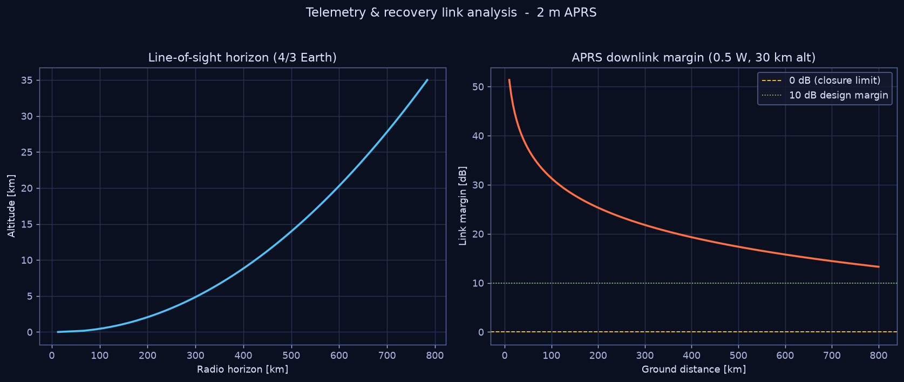

# 05 — APRS / VHF Link Budget & Radio Horizon

`nearspace.comms` sizes the telemetry and recovery radio link. ANSR and most
NASA-ASCEND teams track balloons with **APRS** on the 2 m amateur band; the
whole flight track is recovered through the APRS-IS / aprs.fi digipeater
network.



## Radio horizon (the reason ballooning + APRS works)

VHF is line-of-sight, but a balloon at 30 km can *see* an enormous area. With
the standard **4/3-Earth** refraction model (ITU-R P.834), the horizon distance
from height `h` is:

```
d = √(2·k·R_E·h),     k = 4/3
```

and the total link range is the sum of both stations' horizons:

```
range = √(2·k·R_E·h_tx) + √(2·k·R_E·h_rx)
```

| Balloon altitude | Radio horizon |
|---|---|
| 100 m | 54 km |
| 10 km | 420 km |
| 30 km | **727 km** |

So a 0.5 W tracker at float can be heard across multiple states — which is
exactly how distributed APRS recovery works.

## Free-space path loss (Friis)

Signal strength falls with distance and frequency per ITU-R P.525:

```
FSPL(dB) = 20·log₁₀( 4π·d·f / c )
```

## Link budget

```
EIRP        = P_tx + G_tx − L_cable
P_rx        = EIRP − FSPL + G_rx
link margin = P_rx − Rx_sensitivity
```

Defaults model a typical balloon tracker: **0.5 W** (≈ 27 dBm) into a ¼-wave
whip (~0 dBi), heard by a ground station with a modest 3 dBi vertical, against a
1200-baud AFSK APRS receiver sensitivity of about **−118 dBm**.

| Ground distance | FSPL | Rx power | Link margin |
|---|---|---|---|
| 100 km | 115.6 dB | −86.6 dBm | **+31.4 dB** |
| 300 km | 125.2 dB | −96.2 dBm | **+21.8 dB** |
| 600 km | 131.2 dB | −102.2 dBm | **+15.8 dB** |

The link closes with comfortable margin all the way to the radio horizon — the
binding constraint is geometry (horizon), not signal power.

## Frequencies

| Region | APRS frequency | Notes |
|---|---|---|
| North America | 144.390 MHz | primary APRS (`APRS_FREQ_US`) |
| Arizona / regional balloon | 144.340 MHz | ANSR has used this for HAB (`APRS_FREQ_AZ`) |
| Europe / IARU R1 | 144.800 MHz | `APRS_FREQ_EU` |

Operation is under the **amateur service (FCC Part 97)**; a licensed operator's
callsign is transmitted in each APRS frame (APRS Protocol Reference v1.0.1).

## Practical recovery notes

- Carry a **secondary tracker** (independent battery, ideally a different band
  or a satellite tracker) — APRS coverage has holes in remote terrain.
- The fast upper descent ([03](03_DESCENT_RECOVERY.md)) means the last APRS fix
  before landing may be hundreds of metres up; the landing predictor
  ([06](06_FLIGHT_PREDICTION.md)) bridges that gap.

## Usage

```python
from nearspace.comms import link_budget, radio_horizon_km
lb = link_budget(distance_km=300, tx_alt_m=30_000, tx_power_W=0.5)
print(lb.link_margin_dB, radio_horizon_km(30_000))
```
