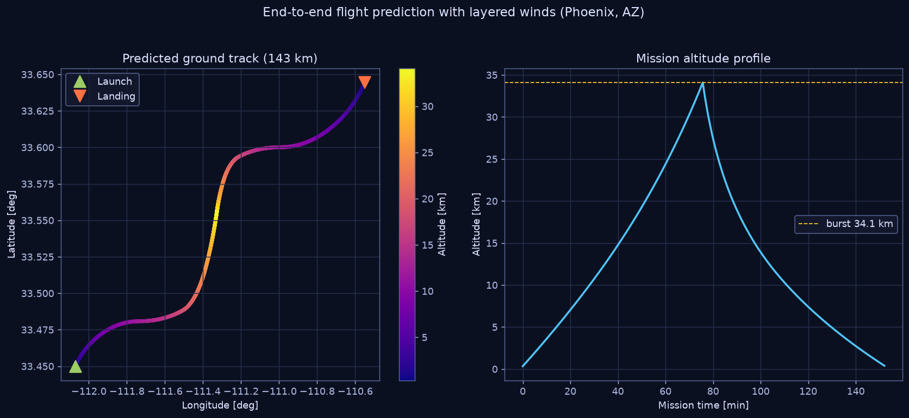

# 06 — Flight-Path Prediction with Layered Winds

`nearspace.flight` ties ascent, burst, and descent together with a layered
horizontal wind field to predict the **ground track and landing point** — the
single most important pre-flight product for go/no-go and recovery planning.
It is the open-methodology equivalent of the Cambridge University Spaceflight
(CUSF) / habhub landing predictor used across the HAB community.



## Method

The balloon has effectively no horizontal inertia relative to the air — it is
advected by the wind at its current altitude. So the algorithm is:

1. Run `simulate_ascent()` → altitude/time samples up to burst.
2. Run `simulate_descent()` → altitude/time samples down to ground.
3. At each step, look up the wind `(speed, direction)` at the current altitude
   from the supplied profile (vector-interpolated to avoid bearing wraparound),
   convert to east/north components, and advance the lat/lon by
   `Δposition = wind · Δt` on a sphere (Aviation Formulary destination point).

```
u_east  = V · sin(θ_to)      v_north = V · cos(θ_to)      θ_to = θ_from + 180°
Δlat = v_north·Δt / R_E      Δlon = u_east·Δt / (R_E·cos lat)
```

The characteristic **S-shaped ground track** in the figure is the signature of
this physics: slow drift low down, a fast streak through the jet-stream core
(~12 km), slow drift near float, then the descent retraces a compressed version.

## Wind input

Winds are supplied as a list of `WindLayer(altitude_m, speed_mps,
direction_from_deg)` using the meteorological convention (direction the wind
blows **from**). For real predictions, populate this from the morning's
**NOAA GFS** forecast (or a rawinsonde sounding) at the launch site. The toolkit
is source-agnostic — any layered profile works.

## Worked result (Phoenix, AZ launch)

```
launch        : 33.4500, -112.0700        (Phoenix, AZ)
burst altitude: 34.10 km
landing       : 33.64, -110.55
range         : ~143 km
flight time   : ~152 min
```

With spring westerlies the payload drifts east toward the high desert — a
recoverable, road-accessible landing typical of Arizona ASCEND flights.

## Using it for go/no-go

1. Pull the launch-morning GFS winds (0–35 km) for the launch site.
2. Run `predict_flight()` for the planned balloon/chute/free-lift.
3. Check the landing point against: restricted/special-use airspace, terrain
   accessibility, water hazards, and crew driving time vs. the ~150 min flight.
4. Sweep free lift / balloon choice if the landing is unacceptable — a higher
   ascent rate shortens drift; a lower burst altitude changes both.

## Sensitivity & dispersion

Real landing points scatter because of wind-forecast error, burst-altitude
spread, and ascent/descent-rate variation. A simple Monte-Carlo wrapper (perturb
the wind layers and burst diameter, re-run `predict_flight`, collect landings)
produces a landing **dispersion ellipse**; the companion ASCEND-S26 MATLAB suite
(`../matlab_ASCEND_S26/src/models/monte_carlo_dispersion.m`) does exactly this
for the flown mission.

## Usage

```python
from nearspace.flight import predict_flight, WindLayer
winds = [WindLayer(0,4,250), WindLayer(12000,32,270), WindLayer(35000,6,220)]
fp = predict_flight(33.45, -112.07, "helium", 1.0, "Kaymont-1500",
                    "Rocketman-60in", free_lift_kg=1.2, wind_profile=winds)
print(fp.landing, fp.range_km, fp.flight_time_s/60)
```
